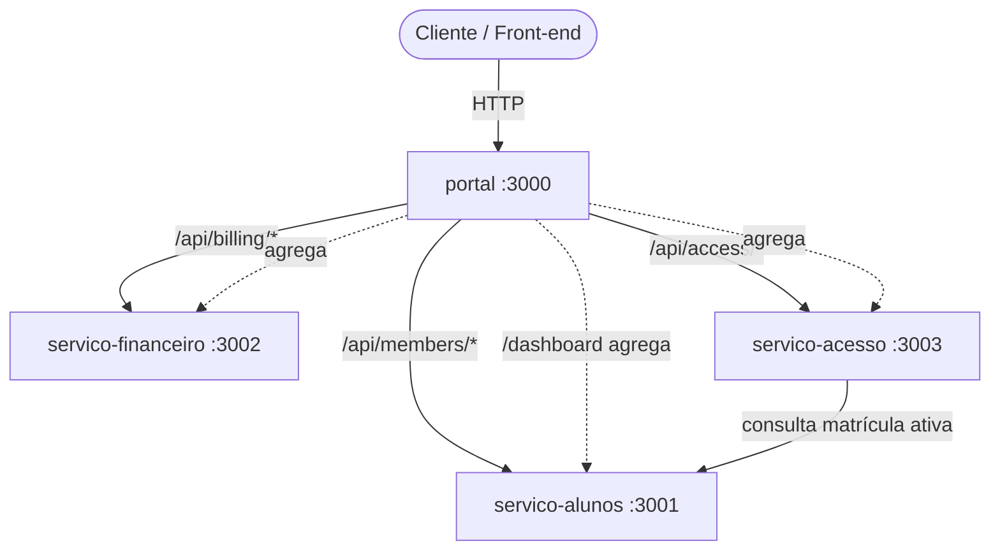

# Gym Control — ERP para Gestão de Academias

Sistema distribuído em **microsserviços** para administração de uma rede de
academias: cadastro de alunos e planos, matrículas com precificação por
fidelidade, emissão e pagamento de mensalidades (com multa por atraso) e
controle de acesso na catraca validando matrícula em tempo real.

Projeto desenvolvido para demonstrar, de forma prática e justificada,
**Clean Code, SOLID, Design Patterns, TDD, BDD, Arquitetura Limpa,
Microsserviços, Docker e Deploy**.

> 🔗 **Link do sistema publicado:** _<preencher com a URL do portal após o deploy — ver [PUBLICACAO.md](./PUBLICACAO.md)>_

---

## 1. Problema e proposta de solução

Academias de médio porte sofrem com sistemas monolíticos que misturam, no mesmo
código, regras muito diferentes entre si: o cadastro de alunos, as regras
financeiras (multas, descontos) e o controle físico de acesso. Mudar a política
de multa exige mexer — e arriscar quebrar — o módulo de matrículas; um pico de
acessos na catraca derruba o faturamento; e a base de código vira um nó difícil
de testar e evoluir.

**Proposta:** separar o domínio em serviços independentes, cada um com sua
responsabilidade, banco e ciclo de vida próprios, comunicando-se por contratos
explícitos. Cada serviço é internamente organizado em **Arquitetura Limpa**, com
o núcleo de regras de negócio isolado de frameworks e de I/O — o que torna o
sistema testável, substituível por partes e fácil de evoluir.

---

## 2. Arquitetura geral e divisão em microsserviços



| Serviço            | Responsabilidade (Bounded Context)                                | Porta |
| ------------------ | ----------------------------------------------------------------- | ----- |
| **servico-alunos** | Alunos, planos e matrículas. Precificação por periodicidade.      | 3001  |
| **servico-financeiro** | Mensalidades/faturas, pagamento e multa por atraso.               | 3002  |
| **servico-acesso**  | Check-in na catraca; libera/bloqueia conforme matrícula ativa.    | 3003  |
| **portal**          | Ponto de entrada único: roteamento (Proxy) + agregação (Facade).  | 3000  |

**Por que esta divisão?** Cada serviço corresponde a um *bounded context* com
um motivo de mudança distinto (cadastro ≠ finanças ≠ acesso físico). São
**independentes**: cada um tem `package.json`, `Dockerfile`, testes e até seu
próprio "shared kernel" (`Dinheiro`, `ErroDeDominio`) duplicado de propósito — nenhuma
biblioteca compartilhada acopla os deploys. A comunicação síncrona
`servico-acesso → servico-alunos` é feita por um **Adapter HTTP** atrás de uma porta de domínio,
de modo que trocar o transporte (REST, gRPC, fila) não afeta a regra de negócio.

---

## 3. Arquitetura Limpa (camadas)

Cada serviço segue a mesma organização em camadas, com a **regra da dependência
apontando sempre para dentro** (infra → aplicação → domínio). O domínio não
conhece Express, HTTP nem banco.

```
servicos/<serviço>/codigo/
├── dominio/          # Núcleo: entidades, objetos de valor, eventos e regras puras.
│                    #         Interfaces de repositório/integração. Zero I/O.
├── aplicacao/        # Casos de uso (orquestração) + portas.
│                    #         Ex.: CasoDeUso, Relogio, GeradorDeIds.
├── infraestrutura/  # Implementações concretas: repositórios em memória, event
│                    #         bus, adapters HTTP, relógio, logger, geradores.
├── apresentacao/    # Entrega HTTP: controladores, intermediarios, rotas, servidor.
└── principal/       # Composition Root (Composicao): monta e injeta tudo.
```

O fluxo de uma requisição: `apresentacao` (controlador) → `aplicacao` (caso de
uso) → `dominio` (entidades/regras) → portas implementadas pela `infraestrutura`.
A `principal/Composicao.ts` é o único ponto que conhece classes concretas e faz a
**injeção de dependência**.

📌 Exemplos: [servico-alunos/codigo/dominio](./servicos/servico-alunos/codigo/dominio) ·
[aplicacao/casos-de-uso](./servicos/servico-alunos/codigo/aplicacao/casos-de-uso) ·
[principal/Composicao.ts](./servicos/servico-alunos/codigo/principal/Composicao.ts)

---

## 4. Princípios SOLID

| Princípio | Onde aparece | Como |
| --------- | ------------ | ---- |
| **S** — Single Responsibility | [`Cpf.ts`](./servicos/servico-alunos/codigo/dominio/objetos-de-valor/Cpf.ts), [`tratamentoDeErros.ts`](./servicos/servico-alunos/codigo/apresentacao/http/intermediarios/tratamentoDeErros.ts) | Cada classe tem um motivo de mudança: o VO valida CPF; o middleware só traduz erro→HTTP; o controlador só adapta HTTP↔caso de uso. |
| **O** — Open/Closed | [`EstrategiaPrecoMatricula.ts`](./servicos/servico-alunos/codigo/dominio/precificacao/EstrategiaPrecoMatricula.ts), [`DecoradorLogCasoDeUso.ts`](./servicos/servico-alunos/codigo/aplicacao/decoradores/DecoradorLogCasoDeUso.ts) | Nova periodicidade/política = nova classe (Strategy); novo comportamento = novo Decorator. Não se altera código existente. |
| **L** — Liskov Substitution | [`InMemoryRepositorioAluno`](./servicos/servico-alunos/codigo/infraestrutura/repositorios/RepositorioAlunoEmMemoria.ts) | Qualquer implementação de `RepositorioAluno` é intercambiável; trocar in-memory por Postgres não quebra os casos de uso. |
| **I** — Interface Segregation | [`portas/`](./servicos/servico-alunos/codigo/aplicacao/portas) | Portas pequenas e focadas (`Relogio`, `GeradorDeIds`, `PublicadorDeEventos`) em vez de uma interface "faz-tudo". |
| **D** — Dependency Inversion | [`MatricularAluno.ts`](./servicos/servico-alunos/codigo/aplicacao/casos-de-uso/MatricularAluno.ts), [`ConsultaMatricula.ts`](./servicos/servico-acesso/codigo/dominio/integracoes/ConsultaMatricula.ts) | Casos de uso dependem de abstrações injetadas; as implementações vivem na infraestrutura e são plugadas no Container. |

---

## 5. Design Patterns (8 aplicados — requisito mínimo: 4)

| Padrão | Local | Propósito no contexto |
| ------ | ----- | --------------------- |
| **Repository** | `dominio/repositorios/*` + `infraestrutura/repositorios/*` | Abstrair persistência de alunos/matrículas/faturas/check-ins. |
| **Strategy** | [`EstrategiaPrecoMatricula`](./servicos/servico-alunos/codigo/dominio/precificacao/EstrategiaPrecoMatricula.ts), [`EstrategiaMultaAtraso`](./servicos/servico-financeiro/codigo/dominio/precificacao/EstrategiaMultaAtraso.ts) | Preço por periodicidade (mensal/trimestral/anual) e multa por atraso. |
| **Factory** | [`ResolvedorEstrategiaPreco`](./servicos/servico-alunos/codigo/dominio/precificacao/ResolvedorEstrategiaPreco.ts) | Selecionar a Strategy correta sem `switch` espalhado. |
| **Observer** | [`BarramentoEventosEmMemoria`](./servicos/servico-alunos/codigo/infraestrutura/eventos/BarramentoEventosEmMemoria.ts) + eventos `AlunoMatriculado`/`FaturaPaga` | Reagir a fatos de domínio (e-mail de boas-vindas, recibo) sem acoplar o publicador. |
| **Decorator** | [`DecoradorLogCasoDeUso`](./servicos/servico-alunos/codigo/aplicacao/decoradores/DecoradorLogCasoDeUso.ts) | Adicionar log/observabilidade a qualquer caso de uso por composição. |
| **Adapter** | [`ConsultaHttpMatricula`](./servicos/servico-acesso/codigo/infraestrutura/integracoes/ConsultaHttpMatricula.ts), [`ApisHttpDosServicos`](./servicos/portal/codigo/agregacao/ApisHttpDosServicos.ts) | Adaptar a API HTTP de outro serviço ao contrato esperado pelo domínio. |
| **Proxy** | [`rotasDoPortal.ts`](./servicos/portal/codigo/http/rotasDoPortal.ts) | Portal encaminha rotas ao microsserviço dono do contexto. |
| **Facade** | [`PainelDoAluno`](./servicos/portal/codigo/agregacao/PainelDoAluno.ts) | Uma chamada agrega dados dos 3 serviços (com degradação graciosa). |

> Bônus: o **Composition Root** (`principal/Composicao.ts`) usa **Singleton** +
> **Factory** para montar o grafo de objetos e injetar dependências.

---

## 6. Evidências de Clean Code

- **Nomes reveladores de intenção**: nos fluxos principais aparecem nomes como
  `aluno`, `plano`, `matricula`, `fatura`, `recibo`, `entradas`,
  `painelDoAluno` e `consultarMatriculaAtiva`, além dos nomes técnicos dos
  padrões (`Repository`, `Strategy`, `Decorator`).
- **Funções pequenas e coesas**, com um nível de abstração por função.
- **Objetos de valor auto-validáveis** (`Cpf`, `Email`, `Dinheiro`): se a instância
  existe, é válida — eliminam validações duplicadas e "dinheiro como `number`".
- **Tratamento de erro centralizado** e tipado (`ErroDeDominio` → 400,
  `ErroServicoIndisponivel` → 503) em vez de `try/catch` espalhado.
- **Sem números mágicos**: percentuais/descontos são constantes nomeadas.
- **Imutabilidade** onde possível; estado de entidade muda só por métodos com
  nome de negócio (`cancel()`, `pay()`, `deactivate()`).
- **Comentários explicam o "porquê"**, não o "o quê".

---

## 7. TDD — Testes unitários

Os testes foram escritos junto com as regras (red → green → refactor) e cobrem
domínio e casos de uso de forma isolada, com **test doubles** (fakes de relógio,
gerador de id, publisher e portal) — sem rede nem banco.

**47 testes unitários** (Jest) no total:
`servico-alunos` (29) · `servico-financeiro` (12) · `servico-acesso` (4) · `portal` (2).

```bash
# por serviço
cd servicos/servico-alunos && npm test
cd servicos/servico-financeiro && npm test
cd servicos/servico-acesso  && npm test
cd servicos/portal         && npm test
```

Exemplos: [`MatricularAluno.test.ts`](./servicos/servico-alunos/testes/unidade/aplicacao/MatricularAluno.test.ts) ·
[`PagarFatura.test.ts`](./servicos/servico-financeiro/testes/unidade/aplicacao/PagarFatura.test.ts) ·
[`RegistrarEntrada.test.ts`](./servicos/servico-acesso/testes/unidade/aplicacao/RegistrarEntrada.test.ts)

---

## 8. BDD — Cenários de comportamento

Escritos em **Gherkin (português)** e executados com **Cucumber**. Descrevem o
comportamento esperado na linguagem do negócio.

**6 cenários** em 3 features:
[matrícula](./servicos/servico-alunos/testes/bdd/funcionalidades/matricula.feature) ·
[pagamento](./servicos/servico-financeiro/testes/bdd/funcionalidades/pagamento.feature) ·
[catraca](./servicos/servico-acesso/testes/bdd/funcionalidades/catraca.feature)

```bash
cd servicos/servico-alunos && npm run bdd
cd servicos/servico-financeiro && npm run bdd
cd servicos/servico-acesso  && npm run bdd
```

```gherkin
# language: pt
Funcionalidade: Matrícula de alunos na academia
  Cenário: Matrícula em plano anual aplica desconto de fidelidade
    Dado um aluno cadastrado chamado "João Pereira"
    E existe o plano anual "plan-annual" a 120 reais por mês
    Quando eu matriculo o aluno no plano "plan-annual"
    Então a matrícula deve ser criada com sucesso
    E o valor da matrícula deve ser de 1224 reais
```

---

## 9. Docker e Docker Compose

Cada serviço tem um **Dockerfile multi-stage** (build TS → imagem de runtime
enxuta com `node:20-alpine`). O [`docker-compose.yml`](./docker-compose.yml)
orquestra os 4 serviços com healthchecks e service discovery interno.

```bash
docker compose up --build
# Portal disponível em http://localhost:3000
# portas configuráveis:
# PORTA_ALUNOS=3101 PORTA_FINANCEIRO=3102 PORTA_ACESSO=3103 PORTA_PORTAL=3100 docker compose up --build
```

---

## 10. Deploy

Instruções completas em **[PUBLICACAO.md](./PUBLICACAO.md)** (Render via Blueprint
`render.yaml`, ou VM única com Docker Compose no Google Cloud/AWS/VPS).
O link público do sistema é o do **portal**.

Para a apresentação e conferência da rubrica, use também o
[`LISTA-DE-ENTREGA.md`](./LISTA-DE-ENTREGA.md).

---

## 11. Como executar localmente (sem Docker)

```bash
# 1 terminal por serviço (ou use docker compose)
cd servicos/servico-alunos && npm install && npm run dev   # :3001
cd servicos/servico-financeiro && npm install && npm run dev   # :3002
cd servicos/servico-acesso  && npm install && npm run dev   # :3003
cd servicos/portal         && npm install && npm run dev   # :3000

# ou suba tudo com build automático em um único comando
PORTA_ALUNOS=3101 PORTA_FINANCEIRO=3102 PORTA_ACESSO=3103 PORTA_PORTAL=3100 bash scripts/subir-dev.sh
```

### Principais endpoints (via portal)

| Método | Rota | Descrição |
| ------ | ---- | --------- |
| GET  | `/health` | Status do portal |
| GET  | `/api/members/plans` | Lista planos |
| POST | `/api/members/students` | Cadastra aluno |
| POST | `/api/members/students/:id/enrollments` | Matricula aluno em um plano |
| GET  | `/api/members/students/:id/membership` | Situação da matrícula |
| POST | `/api/billing/invoices` | Emite mensalidade |
| POST | `/api/billing/invoices/:id/payment` | Paga mensalidade (calcula multa) |
| POST | `/api/access/checkins` | Registra check-in (libera/bloqueia catraca) |
| GET  | `/api/students/:id/dashboard` | **Agrega** matrícula + faturas + check-ins |

---

## 12. Justificativas técnicas (resumo)

- **Microsserviços + Arquitetura Limpa**: isolam motivos de mudança e mantêm o
  núcleo de negócio testável e independente de framework/infra.
- **Persistência em memória atrás do Repository**: torna testes e deploy triviais
  (zero infra) e demonstra a inversão de dependência — trocar por um banco real é
  adicionar uma classe que implementa a mesma porta, sem tocar no domínio.
- **TypeScript estrito + Value Objects**: erros de domínio capturados em tempo de
  compilação e de construção, não em produção.
- **Eventos de domínio (Observer)**: efeitos colaterais desacoplados, prontos
  para virar mensageria (RabbitMQ/Kafka) sem alterar os casos de uso.
- **Portal (Proxy + Facade)**: esconde a topologia interna e reduz o número de
  chamadas do cliente, com degradação graciosa quando um serviço está fora.

---

## Tecnologias

Node.js 20 · TypeScript · Express · Jest (TDD) · Cucumber (BDD) ·
Docker / Docker Compose · http-proxy-middleware.
